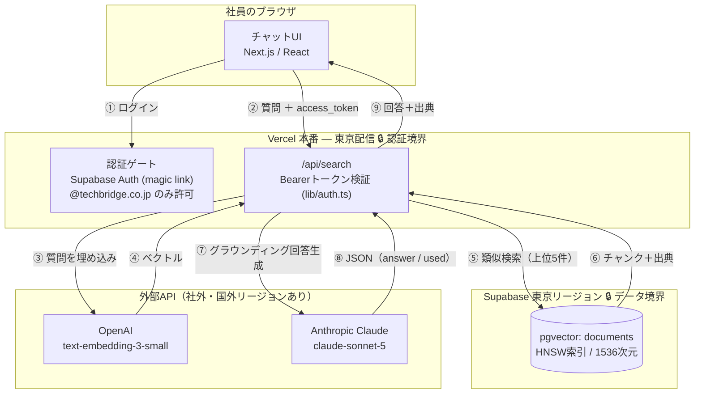
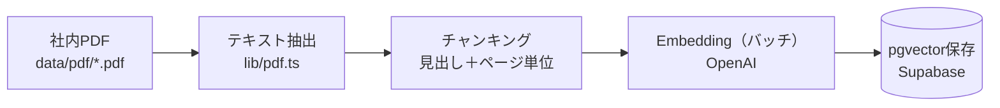

# 社内文書検索AI（RAG） — case3-rag

社内文書（PDF）を読み込ませ、質問に**出典付き**で回答するRAGアプリ。文書に無い内容は「該当する情報が見つかりません」と答え、ハルシネーションを抑制する。

AIエンジニア講座 案件3の成果物（架空クライアント「株式会社テックブリッジ」向けMVP）。

**🔗 公開URL: https://case3-rag.vercel.app**
※認証を社内メールドメイン（`@techbridge.co.jp`）に限定しているため、公開URLはログイン画面まで表示されます（機能デモはローカル環境で実施）。バックエンド（`/api/search`）は本番環境でも動作確認済み。

---

## アーキテクチャ図（情シス向け）

### 質問〜回答の流れ（オンライン）



### 文書取り込みの流れ（オフライン・バッチ）



**セキュリティ境界の考え方**
- **認証境界**＝Vercel。未ログイン／社外ドメインは UI・`/api/search` の両方で拒否（クライアント側ゲート＋サーバー側 Bearer 検証の二重）。
- **データ境界**＝Supabase 東京リージョン。文書本文・ベクトルは国内に保持。
- **社外へ出る通信（クエリ時）**＝Claude（回答生成）へは**質問と上位5チャンクだけ**を送る（文書全文は送らない）。
- **社外へ出る通信（取り込み時）**＝埋め込み生成のため、**チャンク本文がOpenAIへ送られる**（＝実質的に文書内容が社外APIを通る）。SOC2意識・国内完結が要件化した場合は、国内リージョンの埋め込みモデルへ差し替える（Phase2候補）。
- APIキーはすべて環境変数管理でコードに直書きしない。

---

## 技術構成
- **UI/API**: Next.js (App Router) + Vercel
- **DB**: Supabase（東京リージョン）+ pgvector
- **Embedding**: OpenAI `text-embedding-3-small`（1536次元）
- **回答生成**: Anthropic Claude（`claude-sonnet-5`）
- **認証**: Supabase Auth ＋社内メールドメイン制限（クライアント側ゲート＋API側 Bearer 検証）

## 精度（`npm run verify` 実測）
`data/case3-test-questions.csv`（全12問）で検証。

| 種別 | 結果 |
|---|---|
| 文書に記載あり（10問） | **10/10 正答＋出典表示**（目標80%を達成） |
| 文書に記載なし（2問・育児休業/退職金） | **2/2「該当する情報が見つかりません」**＝ハルシネーション抑制 |

---

## 運用手順書（クライアント向け）

納品後、クライアントが**自分たちで文書を追加・保守できる**ようにするための手順。

### 1. 新しいPDFを追加する

1. 追加したいPDFを `data/pdf/` に置く（既存ファイルはそのまま残す）
2. 分割結果だけ先に確認（任意・APIキー不要）
   ```bash
   npm run ingest -- --dry
   ```
3. 本番反映（埋め込み生成＋DB保存）
   ```bash
   npm run ingest
   ```

> **⚠️ 現状の取り込みは「全件洗い替え」方式**です（`documents` を全削除してから入れ直す＝冪等）。PDFを1本足すだけでも**全文書が再度埋め込まれます**。文書数が増えたら差分更新（変更分だけ再埋め込み）に切り替えるのが望ましく、これは **Phase2「差分更新パイプライン」** で対応します。

### 2. Embedding再生成のタイミングとコスト

**再生成が必要なタイミング**
- 文書を追加・更新・削除したとき
- チャンキング設定（`lib/config.ts` の `chunk.size` / `overlap`）を変えたとき
- 埋め込みモデル（`embeddingModel`）を変えたとき ※この場合は `supabase/schema.sql` の次元数も合わせる

**コスト感（`text-embedding-3-small` = $0.02 / 100万トークン）**

埋め込みは非常に安価。仮に PDF 200本・平均30チャンク・1チャンク≒350トークンとすると、1回の全再取り込みで約210万トークン＝**$0.04前後（数円）**。コストよりも「毎回全件を再生成する時間と API 呼び出し回数」が課題になるため、規模拡大時は差分更新（Phase2）で不要な再生成を避ける。
※回答生成（Claude）は**質問1件ごと**に発生する別コスト。上位5チャンクのみを渡して入力トークンを抑えている。

### 3. 回答精度が落ちたときの調査手順

上から順に切り分ける。

1. **回帰テストを回す** — `npm run verify` で12問の正答率を確認。どの問題が落ちたかで当たりをつける。
2. **出典が出ているか** — 出典が出ていれば検索は当たっている＝回答生成（プロンプト/モデル）側を疑う。
3. **検索がヒットしているか** — 出典が的外れなら、対象文書が取り込まれているか（`npm run ingest` 済みか）、チャンクが細かすぎ／粗すぎないかを確認。
4. **索引** — 少量データで最近傍を取りこぼす場合は索引方式を確認（本プロジェクトは `ivfflat` で取りこぼし → **HNSW** に変更して解消済み。下記「設計メモ」参照）。
5. **モデル/プロンプト** — それでも改善しなければ `lib/anthropic.ts` の生成プロンプト、または `lib/config.ts` の `topK` を調整。

---

## Phase2 提案書（追加開発の見積もり）

MVP（本納品）は **PDF取り込み・出典付き回答・社内ドメイン認証** に絞った。以下は「次に何ができるか」を**機能単位で切り分けた**追加提案。総額ではなく機能別に出すことで、クライアントが「どれから始めるか」を選べるようにしている。

| Phase2 機能 | 内容 | 想定費用 | 想定工数 |
|---|---|---|---|
| Word / Confluence 対応 | PDF以外の社内文書（計450件）も取り込み対象に | 15万円 | 3人日 |
| 部署別アクセス制御（RLS） | 部署ごとに閲覧可能文書を制限（Supabase RLS） | 20万円 | 4人日 |
| Slack 連携（Bot化） | Slackから質問→出典付きで回答を返す | 15万円 | 3人日 |
| 差分更新パイプライン | 変更分だけ再取り込み（全件洗い替えの解消） | 20万円 | 4人日 |
| 管理画面（質問ログ・分析） | 質問履歴の可視化・「答えられなかった質問」の抽出 | 25万円 | 5人日 |

**MVPで前倒し対応した項目（当初Phase2想定 → 今回実装済み）**
- **APIのサーバーサイド認証**（`/api/search` の Bearer トークン検証）。当初はクライアント側ゲートのみの想定だったが、未認証の直叩きを塞ぐため MVP に含めた。Phase2ではレート制限・監査ログまで本格化できる。

**既知の運用課題（Phase2で扱う候補）**
- **コールドスタート**：Vercel無料枠では初回リクエストが約6秒（ウォーム時は約2.7秒）。有料枠や常時稼働構成で短縮可能。

---

## セットアップ
1. 依存インストール
   ```bash
   npm install
   ```
2. Supabase（case3専用の新規プロジェクト・東京リージョン）を作成し、`supabase/schema.sql` をSQL Editorで実行
3. 環境変数を設定
   ```bash
   cp .env.local.example .env.local
   # .env.local に各キーを記入
   ```
4. 文書を取り込み
   ```bash
   npm run ingest
   ```
5. 精度検証（任意）
   ```bash
   npm run verify
   ```
6. 開発サーバー起動
   ```bash
   npm run dev
   ```

## ディレクトリ
- `lib/` … 共通ロジック（config / types / chunk / embedding / supabase / auth）
- `supabase/schema.sql` … pgvectorスキーマ＋類似検索RPC
- `scripts/` … 取り込み・検証スクリプト
- `data/` … ダミー文書5本＋精度検証用CSV（12問）

## 開発（Worktree並列）
機能ごとにgit worktreeで並列開発した。
- `feature/embeddings` … 取り込みパイプライン
- `feature/search-api` … 検索＆回答API
- `feature/ui` … チャットUI＋認証

## 設計メモ（実装で得た学び）
- **ベクトルインデックスは HNSW を採用。** 当初 `ivfflat (lists=10)` にしたところ、`probes=1`（既定）が少量データで最近傍を取りこぼし、記載ありの正答が 5/10 に低下。HNSW へ変更して 10/10 に回復した。
- **チャンキングは見出し単位＋ページ番号付き。** PDFから章・節見出し（`第N章` / `N.`）を検出してセクション境界で分割し、出典に「ファイル名＋セクション＋ページ」を付与できるようにした。
- **回答はグラウンディング徹底。** 与えたチャンクのみを根拠にJSON（`answer`/`notFound`/`used`）で生成させ、`used` から出典を機械的に構築。文書外は `notFound=true` で「該当なし」を返す。
- **`.env.local` の読み込み。** `tsx` 実行のスクリプトは既定で `.env` しか読まないため、`lib/loadEnv.ts` で `.env.local` を明示ロードした。

## 納品前チェックリスト（Step4）

| 項目 | 状態 |
|---|---|
| 文書の取り込みが完了している | ✅ ダミー5本＝31チャンク投入 |
| テストで80%以上の正答率 | ✅ 記載あり10/10（＋記載なし2/2） |
| すべての回答に出典（ファイル名＋ページ）が表示 | ✅ |
| 文書にない質問では「該当なし」（ハルシネーションなし） | ✅ 2/2 |
| 応答時間5秒以内 | △ ウォーム約2.7秒で達成／コールド初回のみ約6.6秒（Vercel無料枠特性・Phase2で対策） |
| 認証（社内メールドメイン制限）が動作 | ✅ クライアント側＋API側の二重 |
| APIキーは環境変数管理（コード直書きなし） | ✅ `lib/config.ts` で一元管理 |
| Vercel＋Supabase東京リージョンにデプロイ済み | ✅ |
| アーキテクチャ図が完成 | ✅ 本README |
| 運用手順書が完成 | ✅ 本README |
| Phase2提案書を提出 | ✅ 本README |

> ⚠️ 本リポジトリの文書はすべてRAG検証用のサンプルであり、実在の規程ではありません。
